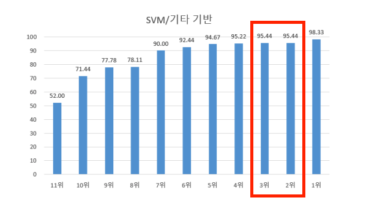

# 2023 기계학습 기말 프로젝트
  - FMCC 문제 / 팀명 : 기하하하학
  - Dataset -> Train : 노이즈 있는 음성 데이터 10000개 / Test : 노이즈 있는 음성 데이터 900개
  - sklearn SVM 모델
  - Test Dataset Accuracy : 95.56%
  - Evaluation Dataset Accuracy : 95.44%
  - 최종 SVM/기타 분야에서 2등
    
  - 나머지는 한글 파일로 기제된 자세한 보고서 내용 참조 -> <a name="기계학습보고서_기하하하학.hwp" href="https://drive.google.com/uc?export=download&id=1QAGvtnPmbxDObrOuoOYno831q77qOKYb">다운로드</a>
  
## **1. 코드 실행 설명**

>### (1) **경로 설정**
>  >
>  >
>  >
>  >위와 같은 train data, test data의 ctl 파일 경로와 디렉토리 경로를 지정해줘야 합니다.
>  
>### (2) **특징 추출 및 전처리**
>  >
>  >코드에 적혀 있는 주석의 순서대로 차례로 실행하면 됩니다. 중간에 데이터 셋을 저장하는 공간을 만들어서 시간이 오래 걸리는 과정을 반복적으로 수행하지 않아도 되도록 만들었습니다.
>  >
>  >
>
>### (3) **모델 테스트 / 예측**
>  >
>  >
>  >
>  >저장된 모델을 경로를 설정하여 불러옵니다.
>  >
>  >

## **2. 패키지, 라이브러리의 설치 및 사용 방법에 대한 설명**
>
>- matplotlib: 이 라이브러리는 데이터 시각화를 위한 도구입니다. 다양한 그래프와 차트를 생성하고 데이터를 시각적으로 분석하는 데 사용됩니다. 
>
>- pandas: 이 라이브러리는 데이터 조작 및 분석을 위한 효과적인 도구입니다. 테이블 형태의 데이터를 다루는 데 유용하며, 데이터 프레임이라는 자료 구조를 제공합니다.
>
>- wave: 이 라이브러리는 WAV 파일을 다루기 위한 기능을 제공합니다. RAW 파일을 WAV 파일로 변환하기 위해서 사용했습니다.
>
>- numpy: 이 라이브러리는 과학적 계산을 위한 강력한 도구입니다. 다차원 배열과 행렬 연산을 지원하며, 수치 계산과 관련된 다양한 함수를 제공합니다.
>
>- noisereduce: 다양한 노이즈 감소 알고리즘을 사용하여 오디오 신호에서 노이즈를 제거하기 위한 라이브러리입니다. ‘Noise Gate’의 형태인 ‘Spectral Gating’ 알고리즘을 사용합니다.
>
>- librosa: 이 라이브러리는 오디오 신호 처리에 특화된 기능을 제공합니다. 오디오 파일의 로딩, 오디오 특성 추출 기능을 제공합니다. 특성 추출 중에서 ‘Mel-Spectrogram’ 추출 기능과, ‘MFCC’ 추출 기능을 사용했습니다.
>
>- sklearn: 이 라이브러리는 머신 러닝 및 데이터 분석에 널리 사용되는 도구 모음입니다. 다양한 머신 러닝 알고리즘, 데이터 전처리 기능, 평가 도구 등을 포함하고 있습니다. ‘Support Vector Machines’ 지도 학습 모델, ‘MinMaxScaler’ 스케일러, ‘PCA’ 차원 축소 기법 클래스를 사용하기 위해서 설치했습니다.
